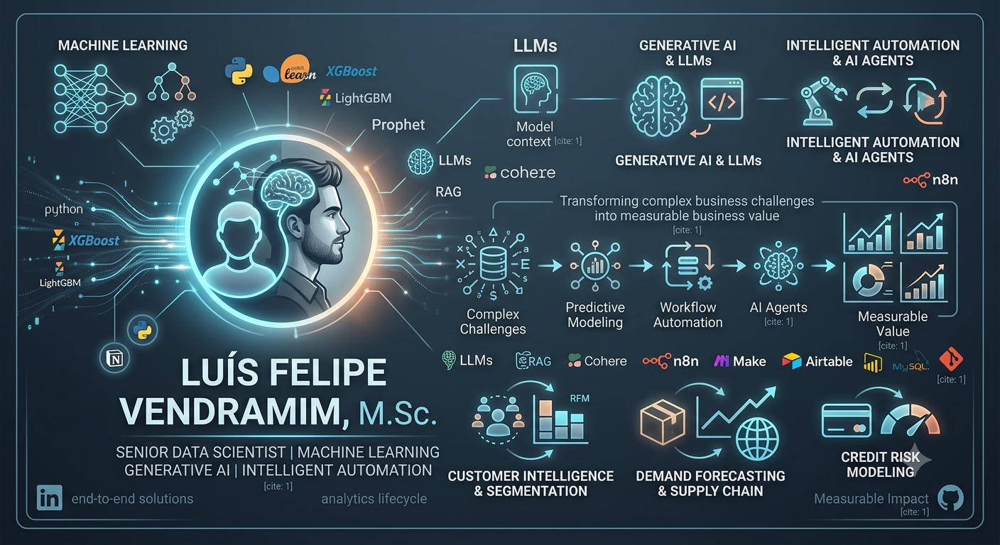

  

 ## Hi, I'm Luís Felipe Vendramim, M.Sc.
 

  <strong>Senior Data Scientist | Machine Learning | Generative AI | Intelligent Automation</strong> 
  Building end-to-end AI and Data Science solutions that transform complex business challenges into measurable business value.

---

## 👨‍💻 About Me

I am a Senior Data Scientist with experience designing end-to-end solutions in Data Science, Machine Learning, Generative AI and Intelligent Automation.

My work combines predictive analytics, AI-powered applications, workflow automation and business strategy to solve complex challenges and generate measurable impact.

I enjoy building practical solutions that bridge data, technology and business, covering the entire analytics lifecycle—from data exploration and predictive modeling to deployment, automation and decision support.

  <a href="#-core-expertise">Core Expertise</a> •
  <a href="#-featured-projects">Featured Projects</a> •
  <a href="#-technology-stack">Technology Stack</a> •
  <a href="#-whats-next">What's Next</a> •
  <a href="#-lets-connect">Let's Connect</a> •
  <a href="#-github-stats">GitHub Stats</a> •

---

## 🚀 Core Expertise

- Machine Learning & Predictive Modeling
- Generative AI & Large Language Models (LLMs)
- Retrieval-Augmented Generation (RAG)
- AI Agents & Intelligent Automation
- Customer Intelligence & Segmentation
- Demand Forecasting & Supply Chain Analytics
- Credit Risk Modeling
- Data Visualization & Business Intelligence
- Workflow Automation & System Integration

---

## 🚀 Featured Projects

Here are some of the projects that best represent my work in Data Science, Machine Learning, Generative AI and Intelligent Automation.

| Project | Business Solution | Technologies | Repository |
|----------|-------------|--------------|--------------|
| 🤖 AI-Powered HR Assistant | Real-time employee support through Generative AI | Python • Cohere • RAG • n8n • MySQL | [🔗 Repository](https://www.linkedin.com/posts/lu%C3%ADs-felipe-vendramim-msc-17b67736_inteligenciaartificial-agentesdeia-iagenerativa-ugcPost-7474784765980643329-ihHp/?utm_source=share&utm_medium=member_desktop&rcm=ACoAAAeSzy8BnmprYFgwFXGrDGGAihWV4Kd8YKk) |
| ⚙️ CRM Automation | Automated lead synchronization and workflow orchestration | Make • Airtable • Notion • APIs | [🔗 Repository](https://github.com/luisfelipevendramim/crm-automation-make-airtable-notion#-tech-stack) |
| 📈 Supply Chain Analytics | Demand forecasting and inventory optimization platform | Python • XGBoost • Prophet | [🔗 Repository](https://github.com/luisfelipevendramim/m5-forecasting-supplychain) |
| 💳 Credit Risk Modeling | Credit risk prediction and model optimization | LightGBM • Logistic Regression • Scikit-Learn | [🔗 Repository](https://github.com/luisfelipevendramim/credit-risk-prediction-lightgbm) |
| 👥 Customer Intelligence | Customer segmentation and qualification | K-Means • Random Forest • XGBoost • LightGBM • Neural Networks • RFM | [🔗 Repository](https://www.linkedin.com/posts/lu%C3%ADs-felipe-vendramim-msc-17b67736_machine-learning-t%C3%A9cnica-de-clusteriza%C3%A7%C3%A3o-ugcPost-7331378002397736960-4ZDy/?utm_source=share&utm_medium=member_desktop&rcm=ACoAAAeSzy8BnmprYFgwFXGrDGGAihWV4Kd8YKk) |

---

## 🛠 Technology Stack

The technologies below represent the tools and platforms I have applied across real-world projects in Data Science, Machine Learning, Generative AI and Intelligent Automation.

### 🐍 Programming
Python • SQL

### 🤖 Artificial Intelligence
Machine Learning • Generative AI • LLMs • RAG • AI Agents • Cohere

### 📊 Data Science & Analytics
Pandas • NumPy • Scikit-Learn • XGBoost • LightGBM • Prophet

### ⚙️ Intelligent Automation
n8n • Make • Airtable • Notion • APIs • Webhooks

### 📈 Business Intelligence
Power BI • Plotly • Matplotlib

### 🗄 Databases
MySQL • Vector Store

### ☁️ Cloud & DevOps
Git • GitHub • Railway • AWS • Azure

---

## 🌱 What's Next?

Technology evolves fast, and so does my learning journey.

I am currently exploring the next generation of AI technologies to build scalable, production-ready solutions:

- 🤖 Agentic AI & Multi-Agent Systems
- 🔗 Model Context Protocol (MCP)
- ☁️ Enterprise AI on AWS & Azure
- 🚀 AI Engineering & MLOps
- 🧩 Scalable LLM Applications

---

## 🤝 Let's Connect

Thank you for visiting my GitHub profile!

I am always interested in connecting with professionals, researchers and organizations that are leveraging Data Science, Machine Learning, Generative AI and Intelligent Automation to solve real-world business challenges.

Whether you're looking to collaborate on innovative projects, discuss AI technologies or explore new opportunities, I'd be happy to connect.

📧 **Email:** luisfelipe100@gmail.com

💼 **LinkedIn:** 

  

🌐 **Portfolio:** 

  

> *Let's build intelligent solutions that create measurable business impact.*

> *Feel free to connect, provide feedback, or discuss ideas related to machine learning and lead automation!*

## GitHub Stats

<!---
luisfelipevendramim/luisfelipevendramim is a ✨ special ✨ repository because its `README.md` (this file) appears on your GitHub profile.
You can click the Preview link to take a look at your changes.
--->
